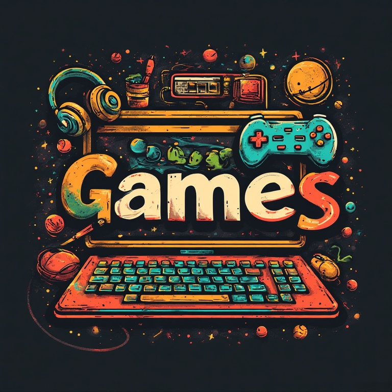

    

-----

    A collection of various games implemented with different languages and frameworks.

-----

## List of games (grouped by a language)

### Javascript/Typescript
* [Breakout](javascript-typescript/breakout-with-javascript) - classical game Breakout implemented with vanilla Javascript
* [Chess](javascript-typescript/chess-with-react-and-rxjs) - Chess game implemented with React and Rxjs
* [Duck Hunt](javascript-typescript/duck-hunt-with-typescript-and-kaplay) - game based on the classical Nintendo game with the same name implemented with Kaplay
* [Escape the Factory](javascript-typescript/escape-the-factory-metroidvania-with-typescript-and-kaplay) - game based on Metroidvania style games implemented with Kaplay
* [Fighting Game](javascript-typescript/fighting-game-with-typescript-and-kaplay) - fighting game in the style of Mortal Kombat implemented with Kaplay
* [Sonic Runner](javascript-typescript/sonic-runner-with-javascript-and-kaplay) - runner game based on the famous game Sonic the Hedgedog implemented with Kaplay
* [Super Mango](javascript-typescript/super-mango-platformer-with-typescript-and-kaplay) - platformer game based on the classic Nintendo game Super Mario Bros implemented with Kaplay
* [Tetris](javascript-typescript/tetris-with-react) - classical game Tetris implemented with React
* [Tic Tac Toe](javascript-typescript/tic-tac-toe-with-react) - classical game Tic Tac Toe implemented with React

### Rust
* [Breakout](rust/breakout-with-rust-and-bevy) - classical game Breakout implemented with Bevy
* [Cat volleyball](rust/cat-volleyball-with-rust-and-bevy) - game based on the classical Pikachu Volleyball implemented with Bevy. Instead of Pikachu characters, two cats are playing a volleyball.
* [Connect4](rust/connect-4-simple-with-rust) - Connect4 game played in a terminal
* [Minesweeper](rust/minesweeper-with-rust-and-macroquad) - classical Windows game Minesweeper implemented with Macroquad
* [Pong (Bevy)](rust/pong-with-rust-and-bevy) - classical game Pong implemented with Bevy
* [Pong (Ggez)](rust/pong-with-rust-and-ggez) - classical game Pong implemented with Ggez
* [Sonic Runner](rust/sonic-runner-with-rust-and-bevy) - runner game based on the famous game Sonic the Hedgedog implemented with Bevy
* [Space Invaders (simple)](rust/space-invaders-simple-with-rust) - classical game Space Invaders implemented for a terminal
* [Space Invaders (Bevy)](rust/space-invaders-with-rust-and-bevy) - classical game Space Invaders implemented with Bevy

### Python
* [Asteroid Shooter (Pygame)](python/asteroid-shooter-with-python-and-pygame-ce) - asteroid shooter game implemented with Pygame-ce
* [Asteroid Shooter 2D (Raylib)](python/asteroid-shooter-with-python-and-raylib-2d) - asteroid shooter game implemented with Raylib
* [Asteroid Shooter 3D (Raylib)](python/asteroid-shooter-with-python-and-raylib-3d) - asteroid shooter game in 3D implemented with Raylib
* [Car Racing](python/car-racing-with-python-and-pygame) - 2D car racing game implemented with Pygame
* [Castle Defender](python/castle-defender-with-python-and-pygame-ce) - castle defender game implemented with Pygame-ce
* [Hangman](python/hangman-with-python-and-pygame) - classical game Hangman implemented with Pygame
* [Jumpy](python/jumpy-with-python-and-pygame) - jumping game based on the popular game Doodle Jump implemented with Pygame
* [Pacman](python/pacman-with-python-and-pygame-ce) - famous game Pacman implemented with Pygame-ce
* [Super Pirate](python/super-pirate-platformer-with-python-and-pygame-ce) - platformer game based on the classic Nintendo game Super Mario Bros implemented with Pygame-ce
* [Tower Defence](python/tower-defence-with-python-and-pygame) - classical game Tower Defence implemented with Pygame

### Java
* [Pong](java/pong-with-javafx) - classical game Pong implemented with JavaFx

-----

## List of libraries and frameworks used

### Javascript/Typescript
* [Kaplay](https://github.com/kaplayjs/kaplay)
* [React](https://github.com/facebook/react)
* [RxJs](https://github.com/ReactiveX/rxjs)

### Rust
* [Bevy](https://github.com/bevyengine/bevy)
* [Ggez](https://github.com/ggez/ggez)
* [Macroquad](https://github.com/not-fl3/macroquad)

### Python
* [Pygame](https://github.com/pygame/pygame)
* [Pygame-ce](https://github.com/pygame-community/pygame-ce)
* [Raylib](https://github.com/electronstudio/raylib-python-cffi)

### Java
* [JavaFx](https://openjfx.io/)
