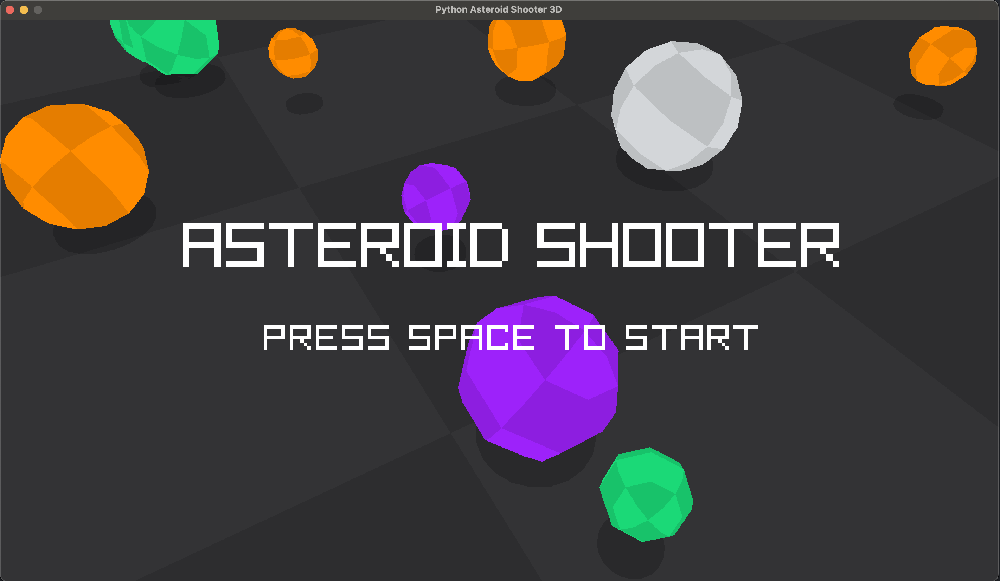
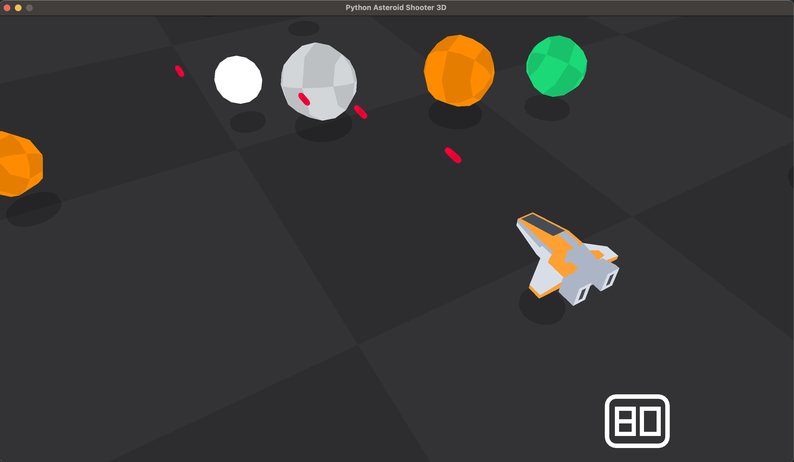

# Asteroid Shooter 3D with Python and Raylib

An implementation of asteroid shooter game in 3D with Python and the game library [Raylib](https://github.com/electronstudio/raylib-python-cffi).

A player controls a flying spaceship and the goal is to avoid crashing it with asteroids which continuously pop up. The spaceship can shoot lasers and with them destroy the asteroids. If it crashes with an asteroid, the game is over.
The goal of the game is to keep the spaceship without crashing as long as possible.

The game is enriched with sound effects and background music.

