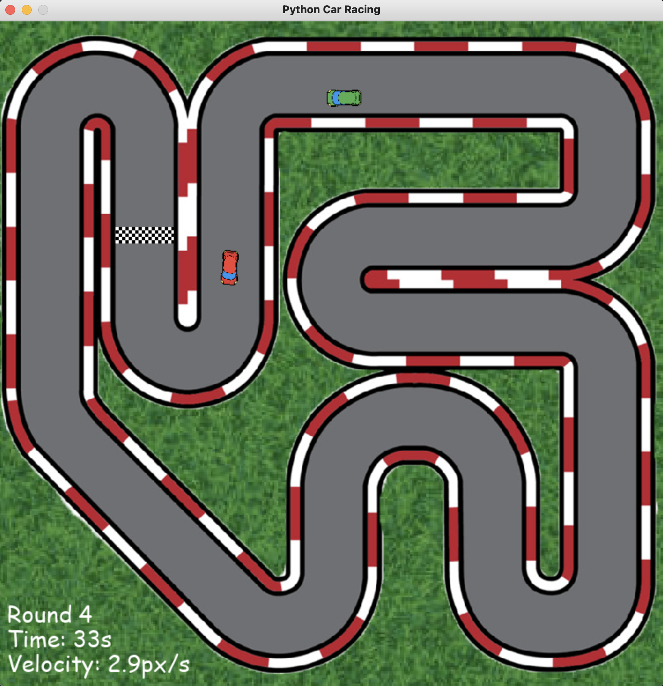

# Car Racing with Python and PyGame

An implementation of a car racing game with Python and the game library [Pygame](https://github.com/pygame/pygame).

There is a racing track and two cars. One car is controled by a player and one by a computer. The goal is to get to the finish line with your car first every round.

The game has 10 rounds. Each time a player wins a round, the speed of the computer car slightly increaces. Player's car accelerates and slows down depending on how the player controls its movement. The computer's car has the same speed the whole round (no acceleration or slowing down).

The player wins the game if his car gets to the finish line first each round. If the computer's car gets to the finish line first in any round, the player loses the game.

