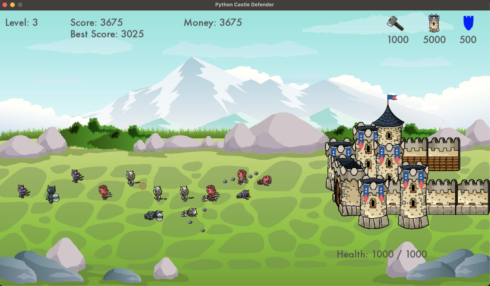

# Castle Defender with Python and Pygame-ce

An implementation of Castle Defender game with Python and the game library [Pygame-ce](https://github.com/pygame-community/pygame-ce).

The game consists of several levels. In each level, the goal is to defend a castle against a wave of invading enemies. A player can shoot them by clicking on them with the mouse. For each killed enemy the player receives score and money. With the money, he can upgrade the castle, which increaces its health, or he can repair it. They player can also buy additional towers, which automatically shoot at the closest enemy. Each action (repair/upgrade castle, buy tower) has a different cost.

In each level the difficulty is increased as well as the number of enemies. The game is won if the player defends the castle in all levels. If in any level the enemies reach the castle and damage it to the point that its health reaches 0, the game is over.

The game is enriched with sound effects.

