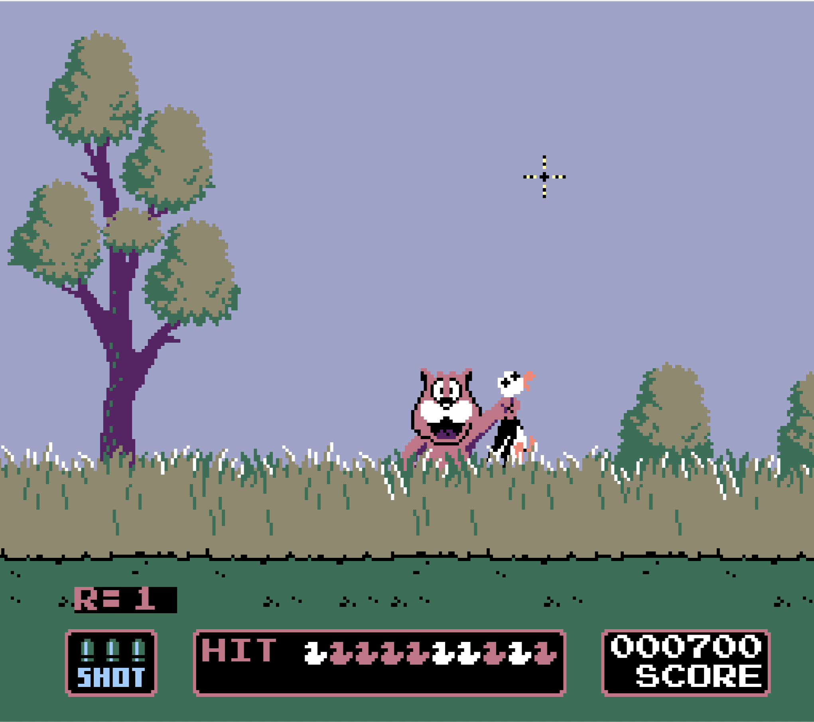

# Duck Hunt with Typescript and Kaplay

An implementation of Duck Hunt based on the classic Nintendo game with the same name with Typescript and the game engine Kaplay.
The goal is to shoot as many ducks as possible. The game is enriched with sound effects and background music.

