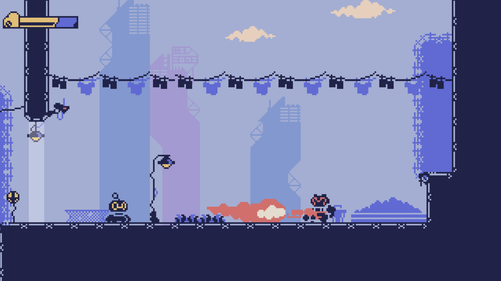

# Escape the Factory with Typescript and Kaplay

An implementation of Escape the Factory game with Typescript and the game engine [Kaplay](https://github.com/kaplayjs/kaplay).

The game is based on Metroidvania style where a player moves to different locations of a map, defeats enemies and level bosses and by that receives special abilities which unlock additional locations.

The goal is to move to through the map and find the exit from the factory. On the way there are drones which follow the player and a boss, who when defeated, unclocks a special ability to double jump. The game is enriched with sound effects.

