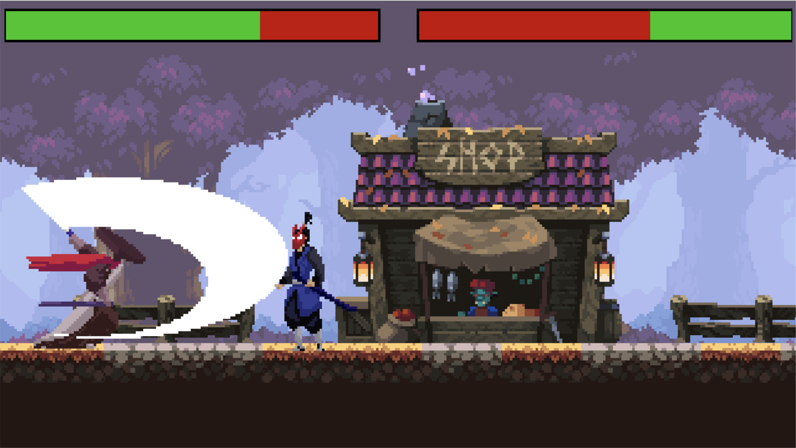

# Fighting Game with Typescript and Kaplay

An implementation of a fighting game in the style of Mortal Kombat with Typescript and the game engine [Kaplay](https://github.com/kaplayjs/kaplay).

There are two enemies standing in front of each other and the goal is to kill the other enemy.

