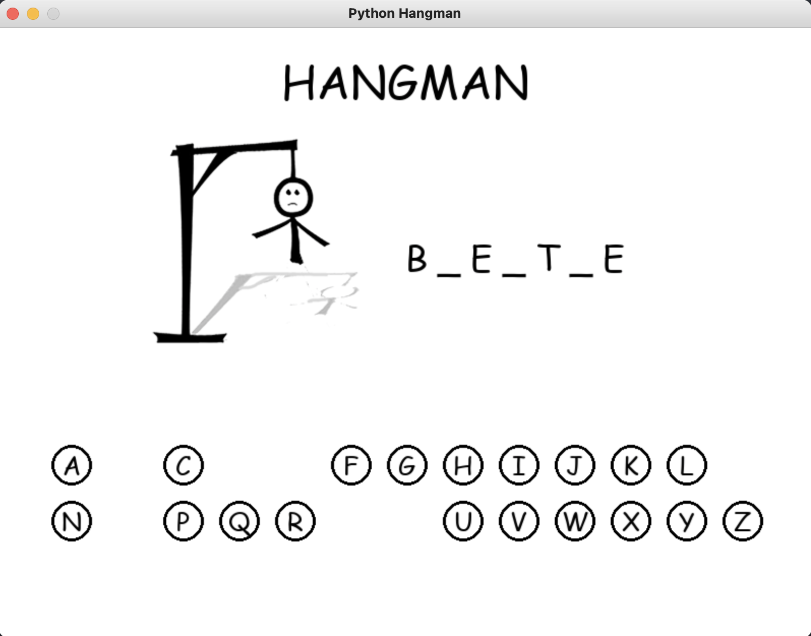

# Hangman with Python and Pygame

An implementation of the classical game Hangman with Python and the game library [Pygame](https://github.com/pygame/pygame).

A player has to guess a word by choosing letters which are contained in it. The letters are chosen by clicking on them. The player wins the game is he finds all letters for the guessed word. It a guessed letter is not a part of the word, additional part of the hangman is drawn. If the whole body of the hangman is drawn, the player loses the game.

