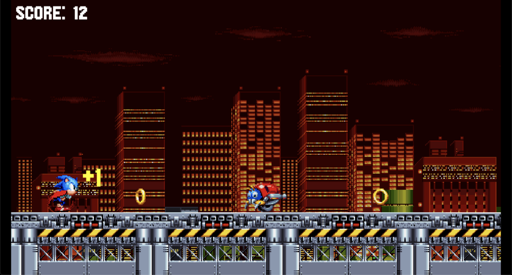

# Sonic Runner with Javascript and Kaplay

An implementation of Sonic runner based on the famous game Sonic the Hedgedog with Javascript and the game engine [Kaplay](https://github.com/kaplayjs/kaplay).

The goal is to collect as many rings and destroy as many motobugs as possible. The game is enriched with sound effects and background music.

