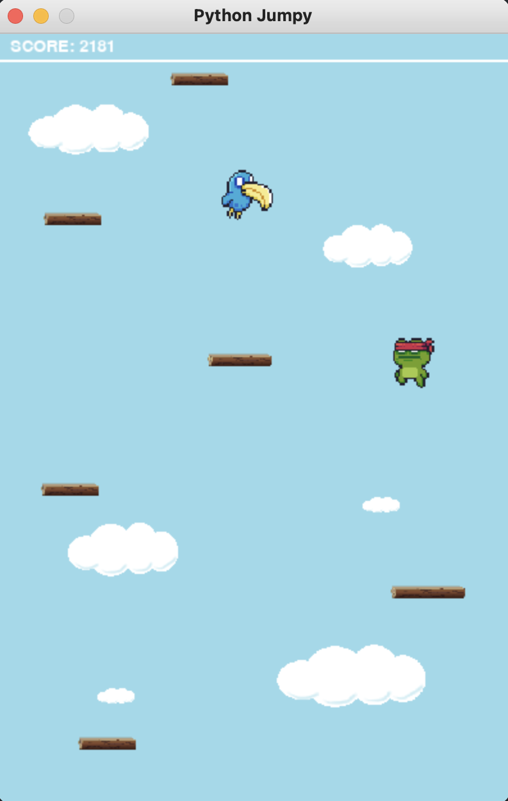

# Jumpy with Python and Pygame

An implementation of a jumping game based on the popular game Doodle Jump with Python and the game library [Pygame](https://github.com/pygame/pygame).

A player controls the character Jumpy, who constantly jumps up and down. He has to jump up on wooden platforms and countinue jumping to the highest platform possible. 

The game gets progressively more difficult as Jumpy continues jumping up and gains higher score. First, some platforms will be moving left and right which makes it more difficult to reach them. Then birds will fly above and disappear when reaching the edge of the screen. The last difficulty is the birds don't disappear, but rather fly back and forth to the edges of the screen.

The goal of the game is to continue jumping up on platforms and gain the highest score. If Jumpy falls down of the screen or he collides with a bird, the game is over.

The game is enriched with sound effects and background music.

