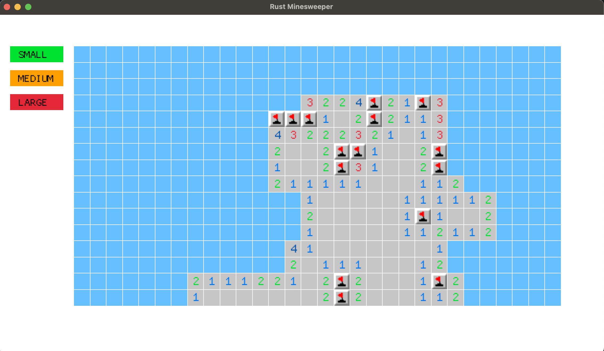

# Minesweeper with Rust and Macroquad

An implementation of the classical Windows game Minesweeper with Rust and the game engine [Macroquad](https://github.com/not-fl3/macroquad).

A user can choose 3 types of boards and difficulties: small, medium or large. Each type has different number of mines.
The game will be restarted every time the user chooses the board type.
The game window is resizeable and the size of the board is adjusted everytime the window size changes.

