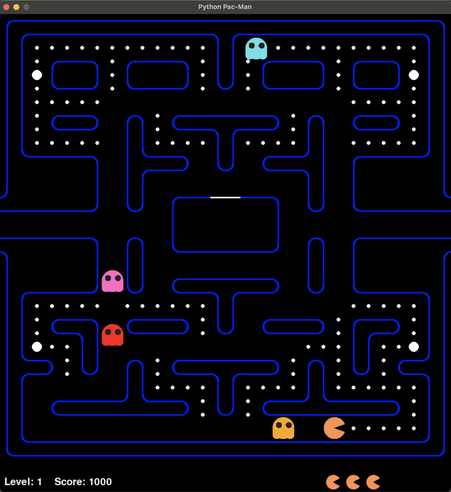

# Pacman with Python and Pygame-ce

An implementation of famous arcade game Pacman with Python and the game library [Pygame-ce](https://github.com/pygame-community/pygame-ce).

The game consists of several levels. In each level, the goal is to eat all dots while avoiding ghosts. There are a couple of big dots. When any of them is eaten, the ghosts turn "spooky" for a short period of time and the Pacman can eat them. After a ghost is eaten, it returns to a box and "resurrects". Then it starts following the Pacman again.

During the game, the Pacman has a certain amount of lives. After he hits a ghost he loses one life. If the Pacman loses the last life, the game is over.

The game is enriched with sound effects.

