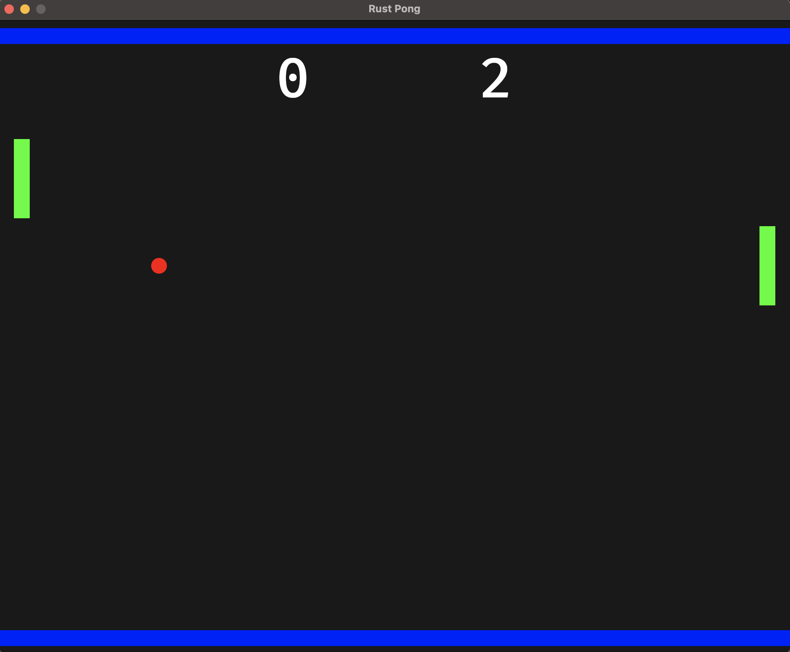

# Pong with Rust and Bevy

An implementation of the classical game Pong with Rust and the game engine [Bevy](https://github.com/bevyengine/bevy).
There are two paddles, one is controled by a player and one with AI.

