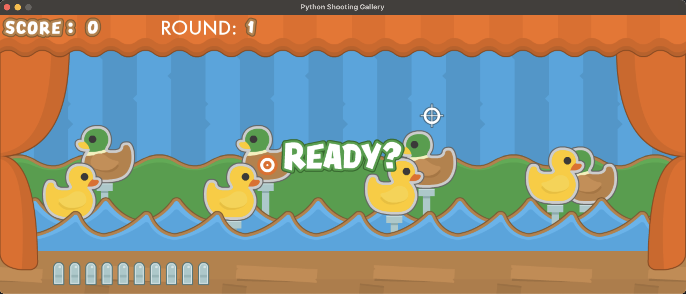
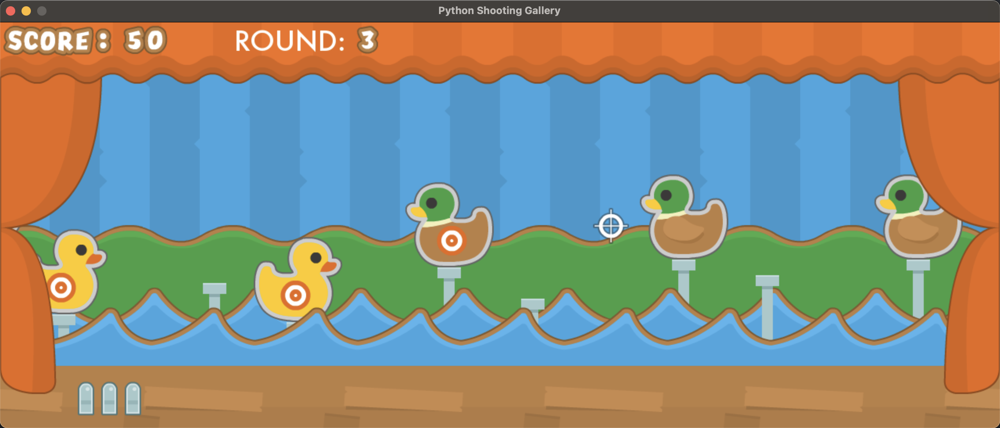

# Shooting Gallery with Python and Pygame-ce

An implementation of Shooting Gallery game with Python and the game library [Pygame-ce](https://github.com/pygame-community/pygame-ce).

The game consists of several rounds. In each round, the goal is to shoot as many moving ducks as possible. A player can shoot them by clicking on them with the mouse. For each shot duck the player receives score. There are different types of ducks, some of them are with a target. Every type as well as a duck with a target contains different score when being shot.

In each round the player has 10 shots. After they are all shot, the round ends and in the next one the difficulty is increased with ducks moving faster. The game is over after the last round ends.

The game is enriched with sound effects.

