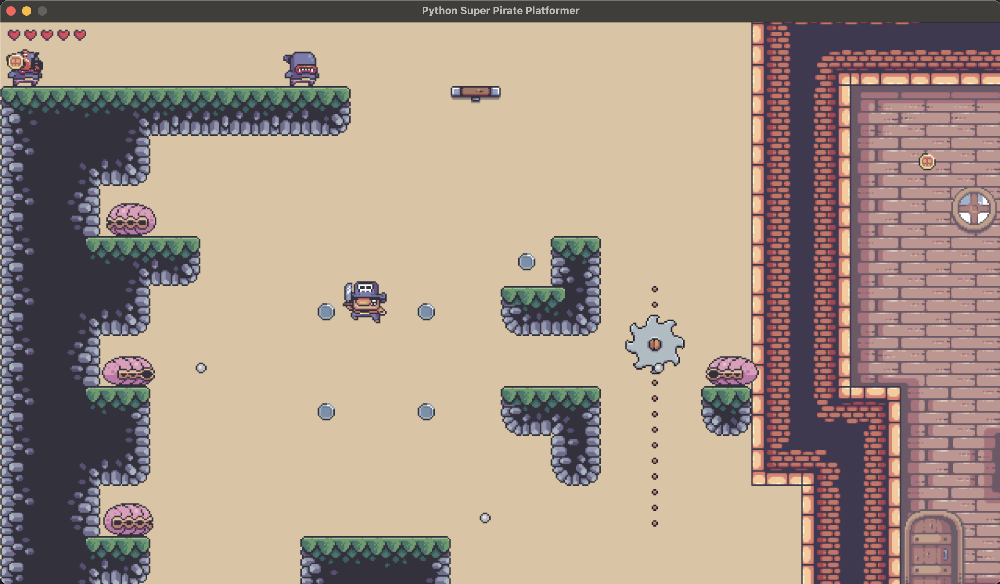
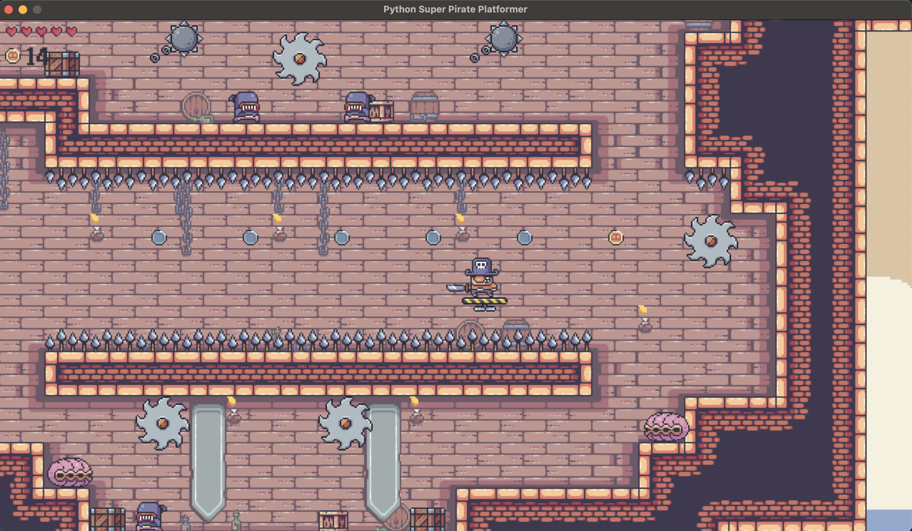
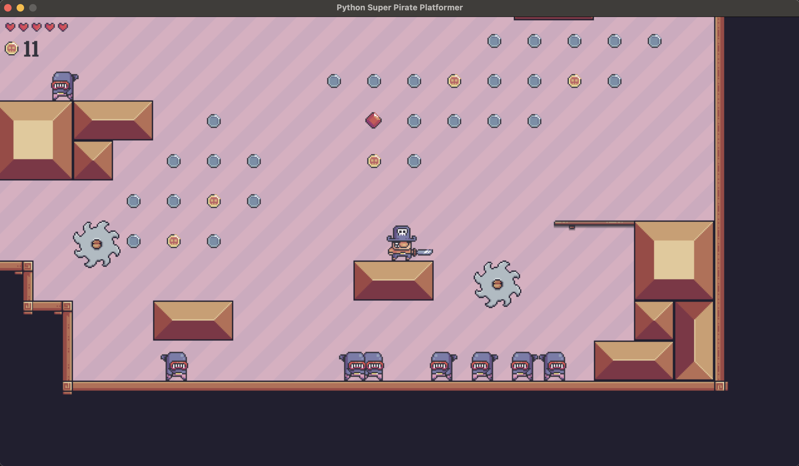
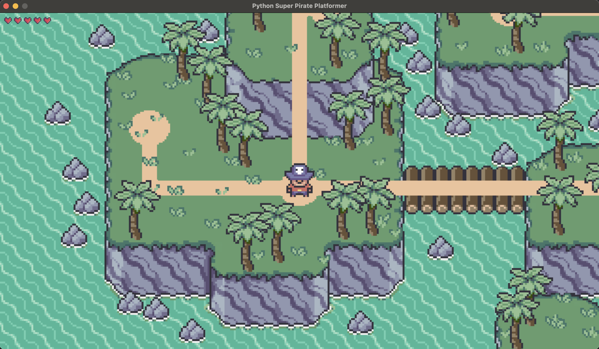

# Super Pirate platformer with Python and Pygame-ce

An implementation of Super Pirate platformer based on the classical Nintendo game Super Mario Bros with Python and the game library [Pygame-ce](https://github.com/pygame-community/pygame-ce).

The game consists of several levels and the overworld map. In each level, the goal is to reach a pirate flag while avoiding enemies and obstacles. The player can run and jump and gets to the overworld after reaching the pirate flag. 
In the overworld, he can follow the path between nodes. Each node represents a level. To get to a particular level, player has to get to stand on a node and press Enter.

During the game, the player has a certain amount of lives. After he hits an enemy or gets shot by any of them, he loses one life. He can also collect items (worth of different coins) and potions. After collecting 100 coins or collecting a potion, the player gets one more life.
If the number of player's lives reaches 0, the game ends.

The game is enriched with sound effects and background music.

