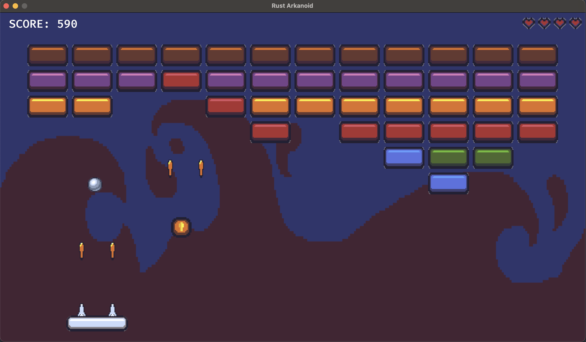
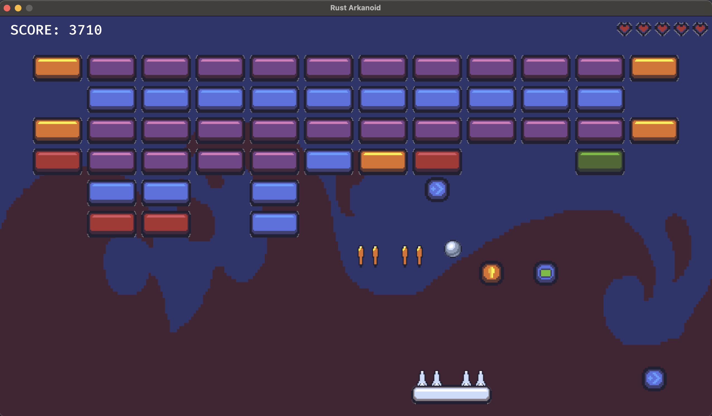
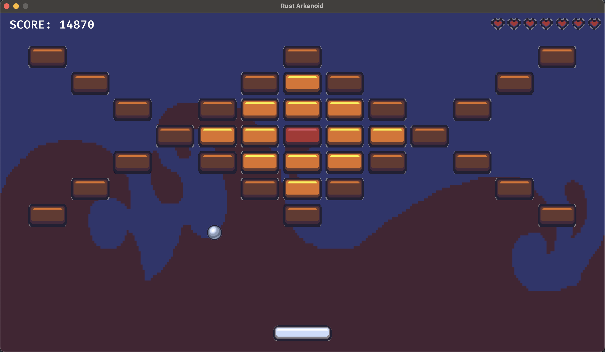

# Arkanoid with Rust and Bevy

An implementation of the classical game Arkanoid with Rust and the game engine [Bevy](https://github.com/bevyengine/bevy).

The goal of the game is to break all bricks on the screen while making sure the ball doesn't fall down. There are upgrades which might appear when the ball hits the bricks and which can be caught by the paddle. With the laser update it is possible to shoot the bricks. It is possible to pause the game while playing.

The game has multiple levels. It is possible to restart it after it is won or lost. The game is enriched with sound effects and background music.

