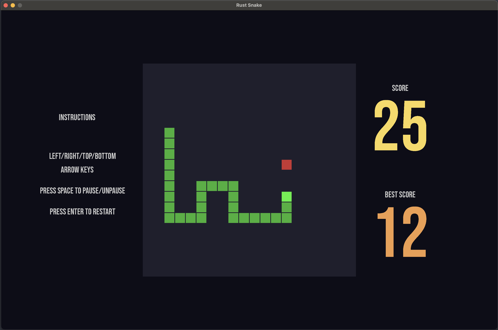

# Snake with Rust and Bevy

An implementation of the classical game Snake with Rust and the game engine [Bevy](https://github.com/bevyengine/bevy).

There is a snake which eats food. The goal is to eat as much food as possible while avoiding hitting a wall or snake's own body. It is possible to pause the game while playing, as well as restart it after it is over. The game is enriched with sound effects.

