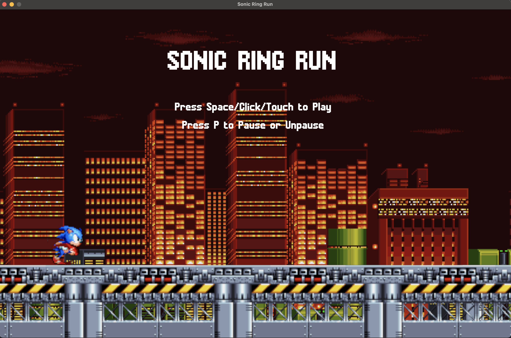
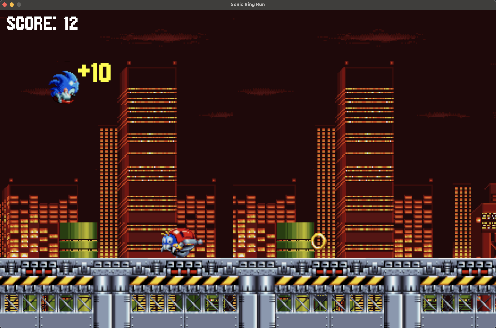

# Sonic Runner with Rust and Bevy

An implementation of Sonic runner based on the famous game Sonic the Hedgedog with Rust and the game engine [Bevy](https://github.com/bevyengine/bevy).

The goal is to collect as many rings and destroy as many motobugs as possible. It is possible to pause the game while playing. The game is enriched with sound effects and background music.

