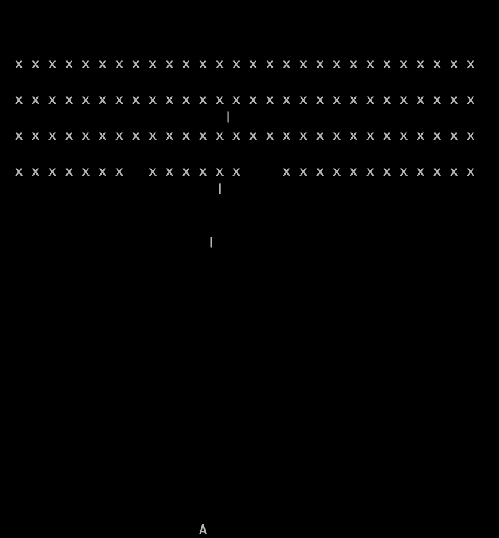

# Space Invaders (simple) with Rust

A simple implementation of Space Invaders game with Rust. The game is run in a terminal, with sounds. 
Rendering of a player and enemies is very simplified with showing only letters end characters as their representation.

