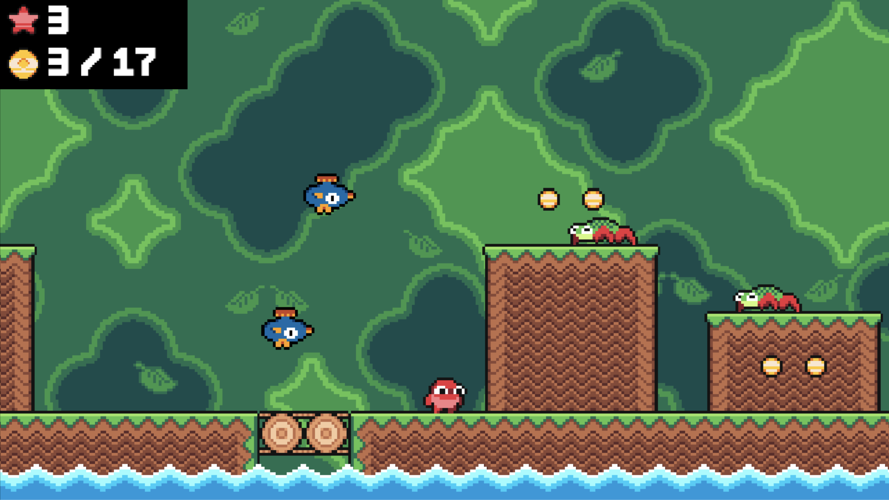

# Super Mango platformer with Typescript and Kaplay

An implementation of Super Mango platformer based on the classic Nintendo game Super Mario Bros with Typescript and the game engine Kaplay.
The game consists of different levels. The goal is to collect all coins in each level while avoiding creatures and obstacles. The player can run and jump and gets to the next level after collecting all coins. The game is enriched with sound effects and background ambience music.

