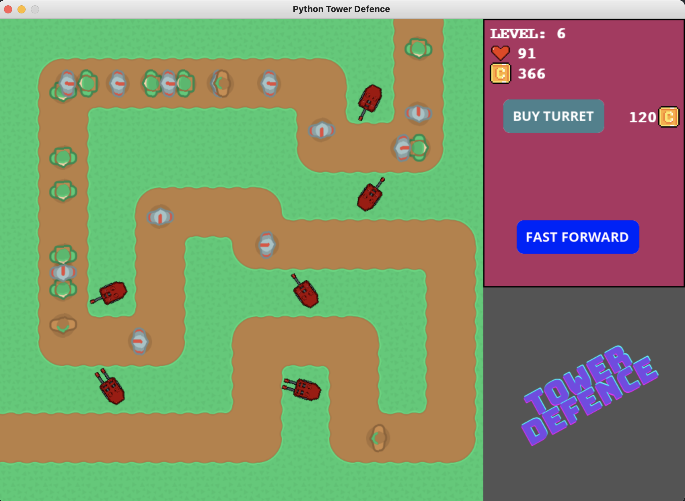

# Tower Defence with Python and PyGame

An implementation of the classical game Tower Defence with Python and the game library [Pygame](https://github.com/pygame/pygame).

The goal is to stop enemies from reaching the exit on a map, by placing defensive turrets along their path of attack. A player can buy turrets and place them on the map along the path (but not on it). Each turret can be upgraded. Buying and upgrading turrets costs certain amoun of coins.

The enemies come in waves. Each wave contains different number and types of enemies. There are 4 types, each with different amount of health and speed. If the enemy's health reaches zero (from turret's damage), he is killed and the player earns one coin for him. If the enemy is not killed and he reaches the map exit, the player loses 1 health point.

The player has certain amount of health points. If the points reach zero during the game, he loses the game. After a wave of attack is finished and the player survives, he gains 100 coins. If the player survives all the waves of enemies, he wins the game.

The enemies' movement can be sped up by holding the Fast Forward button. Every enemy wave starts by clicking the Begin Round button. The game is enriched with sound effects.

